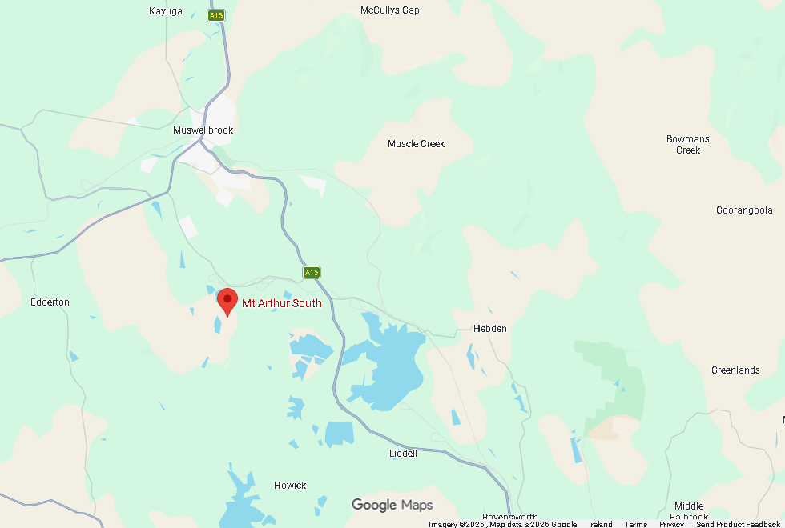
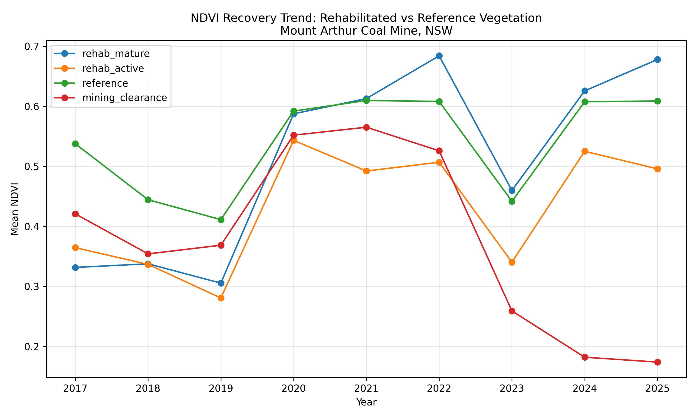

# Vegetation Recovery Monitoring at Mount Arthur Coal Mine, NSW
### Google Earth Engine Time-Series Analysis | Python | Sentinel-2

**Portfolio Project 1** — GIS & Remote Sensing Portfolio targeting environmental consulting and mining roles, Australia

---

## Project Overview

This project monitors vegetation recovery across rehabilitated landforms at Mount Arthur Coal Mine in the Hunter Valley, NSW, using a multi-year Sentinel-2 time-series analysis in Google Earth Engine. The pipeline tracks vegetation greenness (NDVI) across four land cover zones from 2017 to 2025, replicating the type of annual rehabilitation performance monitoring required under Australian mining environmental approvals.

The analysis detects three distinct land cover trajectories within a single study area: progressive vegetation recovery on rehabilitated mine landforms, stable native reference vegetation, and active vegetation clearance associated with ongoing mine expansion — demonstrating the pipeline's capacity to characterise the full spectrum of land cover dynamics at an active mine site.

---

## Study Area

**Mount Arthur Coal Mine**, Muswellbrook, Hunter Valley, NSW — one of Australia's largest open-cut coal operations, operated by BHP. The mine has an active rehabilitation program targeting native woodland and grassland re-establishment on reconstructed overburden landforms.



Four zones were digitised for analysis:

| Zone | Description |
|------|-------------|
| `rehab_mature` | Established rehabilitation on older reconstructed landforms |
| `rehab_active` | Ongoing rehabilitation on more recently constructed landforms |
| `reference` | Undisturbed native eucalypt woodland adjacent to mine boundary |
| `mining_clearance` | Native vegetation subsequently cleared for mine expansion (2022–2023) |

---

## Methods

### Data
- **Sensor:** Sentinel-2 Surface Reflectance (`COPERNICUS/S2_SR_HARMONIZED`)
- **Resolution:** 10m
- **Temporal range:** 2017–2025 (9 annual composites)
- **Cloud filtering:** Scenes with >20% cloud cover excluded; QA60 band used for per-pixel cloud and cirrus masking
- **Compositing:** Annual median composites to reduce seasonal and atmospheric noise

### Indices Computed
- **NDVI** (Normalised Difference Vegetation Index): `(B8 - B4) / (B8 + B4)` — primary indicator of vegetation greenness and density
- **BSI** (Bare Soil Index): `((B11 + B4) - (B8 + B2)) / ((B11 + B4) + (B8 + B2))` — tracks bare ground exposure, complementary to NDVI for rehabilitation monitoring

### Analysis
- Zonal mean NDVI and BSI extracted per zone per year using `reduceRegion`
- Percentage of pixels exceeding NDVI threshold of 0.4 (indicative of active vegetation cover) computed per zone per year
- NDVI difference map (2025 minus 2017) computed to show spatial patterns of change across the AOI

### Tools & Environment
- Google Earth Engine Python API
- geemap, geopandas, pandas, matplotlib
- Google Colab (fully cloud-based, no desktop GIS license required)

---

## Results

### NDVI Recovery Trend (2017–2025)



By 2025, both rehabilitated zones approach reference vegetation NDVI values, with rehab_mature (0.68) exceeding the reference zone (0.61) — indicative of dense grass and early shrub establishment on the reconstructed landforms.

### Percentage of Zone Exceeding NDVI 0.4 Threshold

| Year | rehab_mature | rehab_active | reference |
|------|-------------|-------------|-----------|
| 2017 | 30.4% | 29.3% | 92.8% |
| 2018 | 33.8% | 15.9% | 67.6% |
| 2019 | 17.1% | 2.2% | 42.9% |
| 2020 | 96.2% | 93.6% | 98.2% |
| 2021 | 98.0% | 91.0% | 98.8% |
| 2022 | 99.0% | 93.9% | 99.1% |
| 2023 | 58.7% | 15.3% | 50.7% |
| 2024 | 98.6% | 95.7% | 98.8% |
| 2025 | 98.8% | 91.2% | 98.9% |

### Key Findings

**Rehabilitation trajectory:** Both rehab zones show a clear positive NDVI trend from 2017 to 2025. The mature rehabilitation zone increases from 30% to 99% vegetated cover (NDVI >0.4), reaching parity with the reference native vegetation by 2021–2022 and maintaining it through 2025. The active rehabilitation zone shows a similar trajectory, reaching 91% vegetated cover by 2025 from a base of 29% in 2017.

**2019 drought signal:** A pronounced NDVI decline is visible across all zones in 2019, with rehab_active falling to just 2.2% vegetated cover. With 76 cloud-free scenes available for 2019 — the highest of any year in the study period — this decline reflects real landscape-wide vegetation stress rather than data scarcity. The signal is consistent with the severe pre-bushfire drought conditions documented across eastern NSW in 2019, which preceded the 2019–20 Black Summer fire season.

**2023 El Niño signal:** A second drought-driven decline is visible across all zones in 2023, consistent with the strong El Niño event recorded across eastern Australia that year. Both rehabilitation zones recover strongly to near-reference levels by 2024, suggesting the established vegetation has sufficient root development and soil structure to recover rapidly from short-term moisture stress — a positive indicator of rehabilitation maturity.

**Mining expansion detection:** The mining_clearance zone tracks reference vegetation values through 2022 (NDVI ~0.53) before declining sharply to 0.26 in 2023 and 0.17–0.18 by 2024–2025, consistent with progressive vegetation clearance ahead of mine expansion. This unplanned finding demonstrates the pipeline's capacity to detect active disturbance within the same time-series framework used to monitor rehabilitation.

---

## Discussion & Limitations

The convergence of both rehabilitation zones toward reference NDVI values by 2021–2022 suggests successful grass and early shrub establishment on reconstructed landforms at Mount Arthur — a positive rehabilitation outcome within approximately 4–5 years of monitoring. However, NDVI alone cannot distinguish between grass-dominated and woody vegetation cover; a rehabilitated site dominated by annual grasses would show similar NDVI values to one with established native woodland, despite representing a very different ecological outcome. Future analysis incorporating canopy height data (e.g. LiDAR or GEDI) or hyperspectral indices sensitive to plant functional type would provide a more complete picture of rehabilitation quality beyond simple vegetation density.

The 2019 and 2023 drought signals highlight the importance of multi-year time-series analysis over single-date comparisons for rehabilitation monitoring — a single assessment in either drought year would substantially underestimate rehabilitation progress. Annual reporting frameworks used in Australian mining environmental approvals would benefit from contextualising single-year NDVI values against multi-year baselines of the kind generated by this pipeline.

Cloud cover filtering (>20% scene threshold) provided sufficient imagery for all years (minimum 7 scenes in 2017, maximum 76 in 2019), though the relatively low 2017 count (7 scenes) means the earliest annual composite carries higher uncertainty than subsequent years.

---

## Repository Structure

```
├── notebooks/
│   └── Project1_MineRehab_v2.ipynb    # Main analysis notebook
├── data/
│   └── mount_arthur_aoi.geojson       # AOI zone polygons
├── outputs/
│   ├── ndvi_trend.png                 # NDVI time-series chart
│   └── ndvi_change_map.tif            # NDVI difference raster (2025 - 2017)
└── README.md
```

---

## How to Run

1. Open `notebooks/Project1_MineRehab_v2.ipynb` in Google Colab
2. Mount Google Drive and authenticate Earth Engine (Cells 1 and 4)
3. Run all remaining cells in order (`Runtime → Run all`)

Requires a Google Earth Engine account with a registered Cloud Project (free noncommercial tier sufficient). All other dependencies (geemap, geopandas, pandas, matplotlib) are pre-installed in Colab or installable via `%pip install -U geemap`.

---

## Skills Demonstrated

- Google Earth Engine Python API — ImageCollection filtering, cloud masking, spectral index computation, zonal statistics, change detection
- geemap — interactive map display, GeoDataFrame to Earth Engine conversion
- geopandas — vector data handling and AOI management
- pandas / matplotlib — time-series data wrangling and visualisation
- Cloud-based reproducible GIS workflow (fully executable in Google Colab, no desktop license required)

---

## Author

**Luke Kennedy**
BSc Geography & Geology, UCD | MSc GIS & Remote Sensing, UCD
(https://github.com/lukek6892)
```
